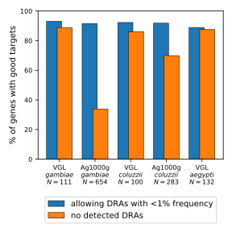
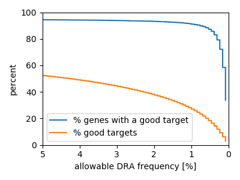

## Genomes ##

| | Anopheles gambiae s.l. (AgamP4.11) | Aedes aegypti (AaegL5.1) | 
| --- | --- | --- |
| **Genome size (Mbp)** | 230.5 | 1,195 |
| **Coding part of the genome (Mbp)** | 25.7 (11.2%) | 59.1 (5%) |
| **Protein-coding genes** | 12,562 | 13,601 |
| --- | --- | --- |
| **Raw targets** | 3,918,579 | 3,638,628 |
| **Potential targets** | 1,196,509 (30.5%) | 828,454 (22.8%) |
| **Protein-coding genes with potential targets** | 12,213 (97.2%) | 12,536 (92.2%) |

## Datasets ##

| **dataset** | VGL-gam | Ag100g-gam | VGL-col | Ag1000g-col | VGL-Aaeg |
| --- | --- | --- | --- | --- | --- |
| **species** | An. gambiae s.s. | An. gambiae s.s. | An. coluzzii | An. coluzzii | Ae. aegypti |
| **num. samples** | 111 | 654 | 100 | 283 | 132 |
| **seq. depth\*** | 8x | 30x | 10x | 30x | 10x |
| **countries** | Cameroon, Comoros, Mali, Tanzania, Zambia | Burkina Faso, Cameroon, Eq. Guinea, Mayotte (Fr.), Gabon, Ghana, Guinea, Uganda | Benin, Cameroon, Eq. Guinea, Mali, São Tomé and Príncipe | Angola, Burkina Faso, Côte d'Ivoire, Ghana, Guinea | Mexico, South Africa, California USA, Florida USA |
| **years** | 2006, 2011, 2015 | 2000, 2002, 2009, 2011, 2012 | 2002, 2004, 2005, 2006, 2010, 2011, 2012, 2014, 2015, 2017 | 2009, 2012 | 2013, 2014, 2015, 2016, 2017, 2018 |
| **nucleotide diversity\*\*** | 0.98% | 1.02% | 1.00 | 0.95% | 0.94% |

\* median sequencing depth of all coding transcript position and all samples  
\** for coding transcripts only

> The nucleotide diversity of coding transcripts for each dataset is near 1%.  
> Genome-wide nucleotide diversity is estimated at 2% for each of the gambiae and coluzzii datasets.  The estimate based on VGL-Aaeg is 1.3%, but this is likely a significant underestimate since aegypti contains many highly polymorphic regions which fail to sequence or map to the reference well.  
> As a point of comparison, a relatively high estimate of human nucleotide diversity is 0.6% (https://www.nature.com/articles/nature15393).  

## Results ##
*Note: DRA = Drive Resistance Allele.  
In this context the % DRA is the percent of variant allels we deem acceptable*

