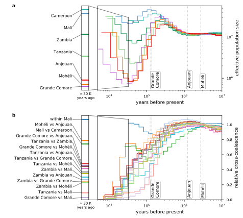
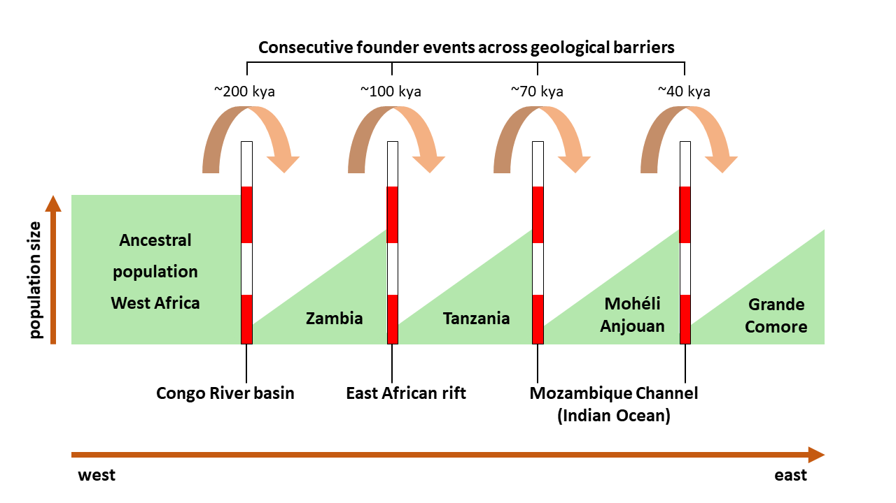

# Rough overview of: #
# A new model of West African origin and transcontinental dispersal via serial founder events of Anopheles gambiae #
Hanno Schmidt, Yoosook Lee, Travis C. Collier, Mark J. Hanemaaijer, Oscar D. Kirstein, Ahmed Ouledi, Mbanga Muleba, Douglas E. Norris, Montgomery Slatkin, Anthony J. Cornel, Gregory C. Lanzaro

---

### Collection sites ###

### Genetic variability ###

### Fst Analysis... The main event ###

### Admixture ###

### SpaceMix - geogenetic space projection ###

### MSMC2 - Population size history ###

### Descriptive theory summary ###

